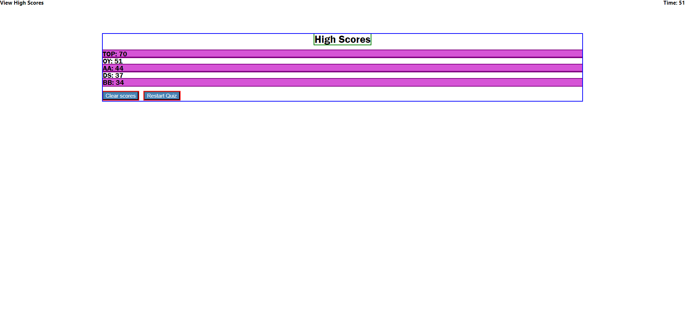

# Code Quiz

___

## Project Description

This is a code quiz that asks questions in a random order. Score is determined by the amount of time remaining on the quiz. Each score is recorded along with the user's initials in local storage. The top 5 scores are displayed on the high scores page.

## How to run this project

Click this link to visit the site:
[Code Quiz](https://kiyodosan.github.io/UCI-BOOTCAMP-WEEK-3-PASSWORD-GENERATOR/)

Click the "Start Quiz" button to start the quiz and the timer.

## How to use this project

The user clicks on the "Start Quiz" button to start the quiz. A page containing a question is generated with multiple buttons below it and a timer is started in the top-right corner. Each button contains an answer for the user to guess with. When the user clicks on an answer button, their guess is checked for correctness. If the guess is wrong, then quiz time is reduced. Each time an answer button is clicked, the next question is generated until there are no more questions. Scores are based on the amount of time remaining on the quiz.

After all questions have been answered, the user is prompted to enter 2 or 3 characters for their initials. The initials and their score are saved to local storage and a high scores page is generated.

The high scores page can be accessed at any time before or during the quiz by clicking on the "View High Scores" text in the top-left corner of the page. Whether the page is generated manually or by finishing the quiz, a list of the top 5 high scores is displayed. The user can also find buttons below the list which give them the option to clear all scores from local storage or restart the quiz.

## Credits

Tyler Odo
https://stackoverflow.com/questions/17745292/how-to-retrieve-all-localstorage-items-without-knowing-the-keys-in-advance
https://www.w3schools.com/jsref/jsref_sort.asp

## License

Default